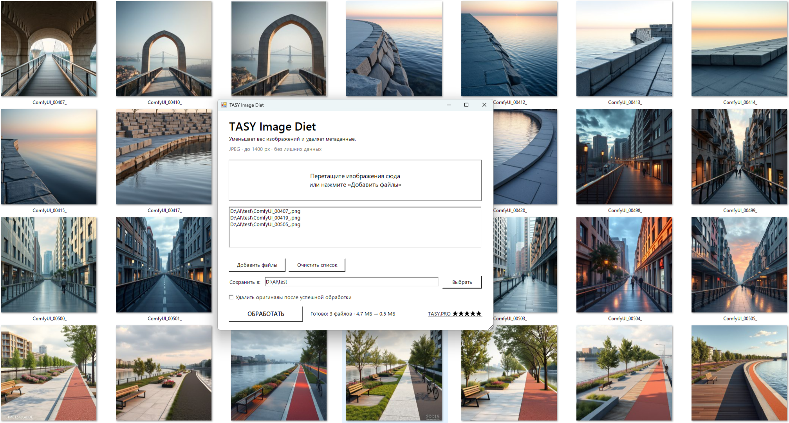
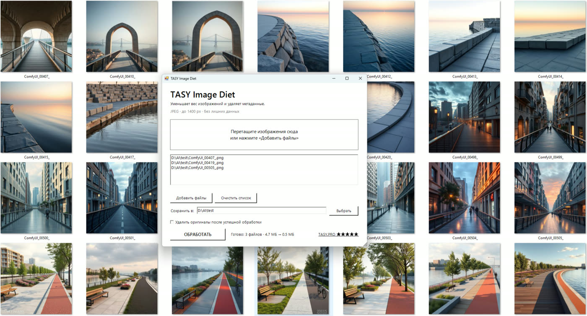
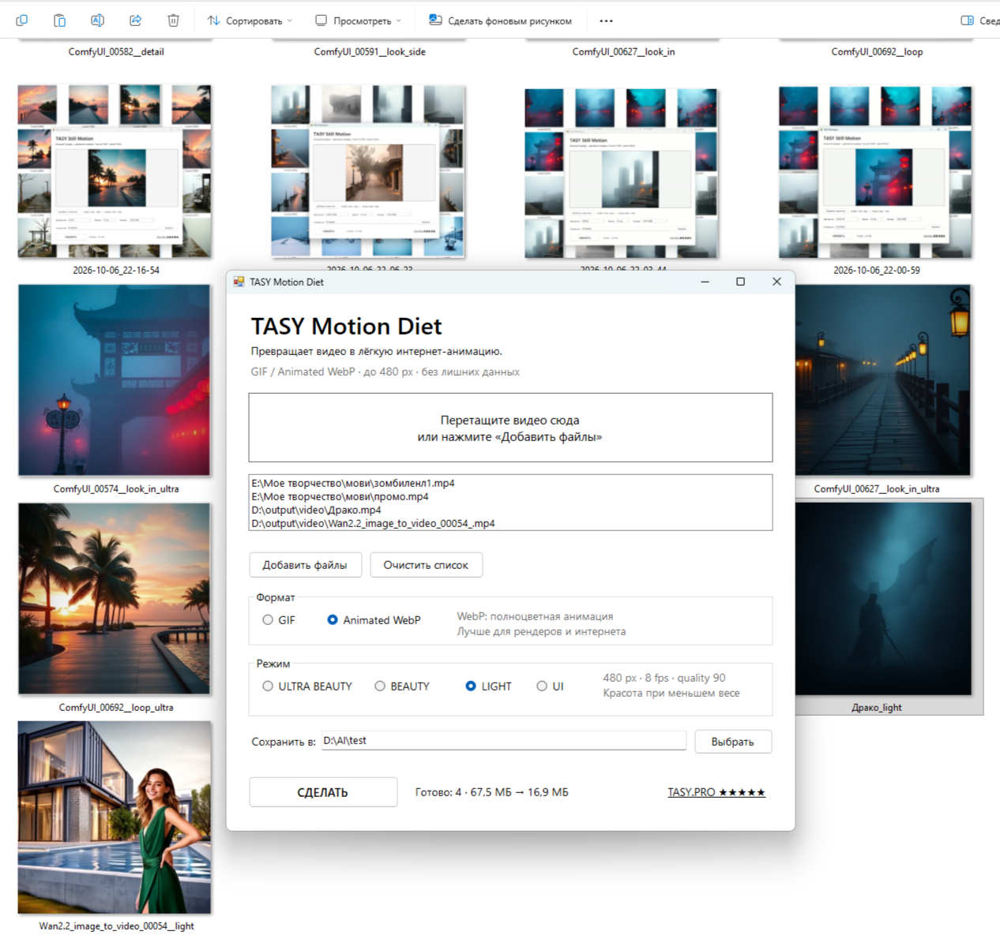
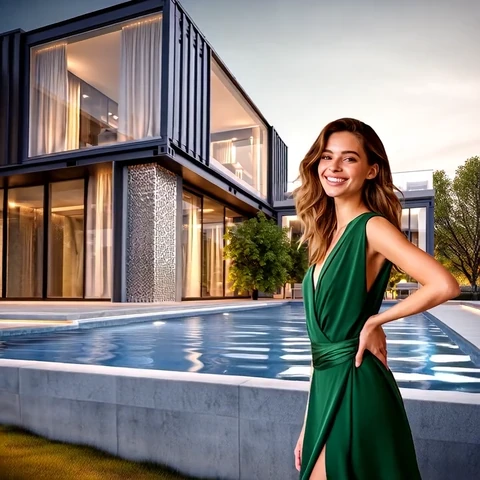
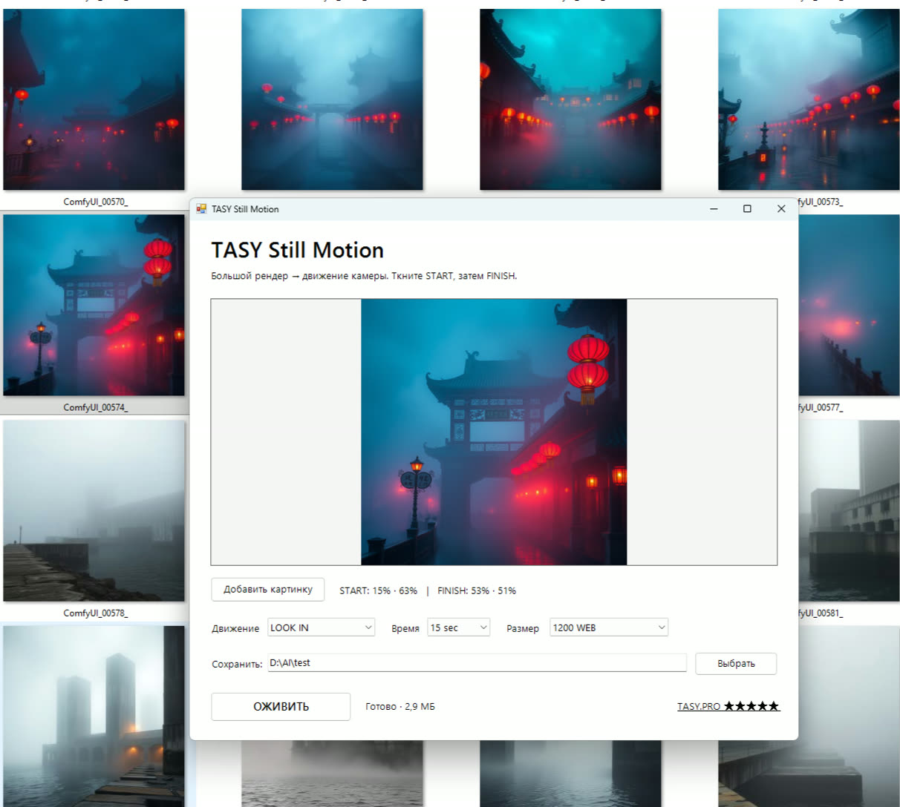
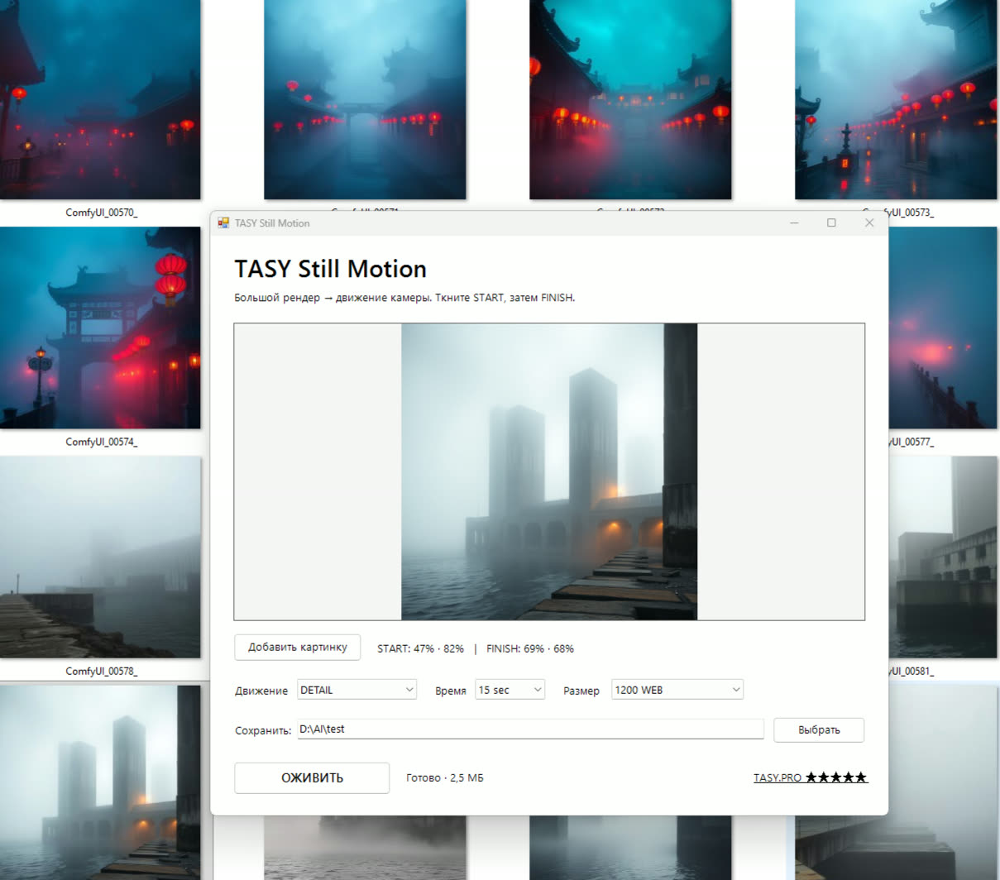
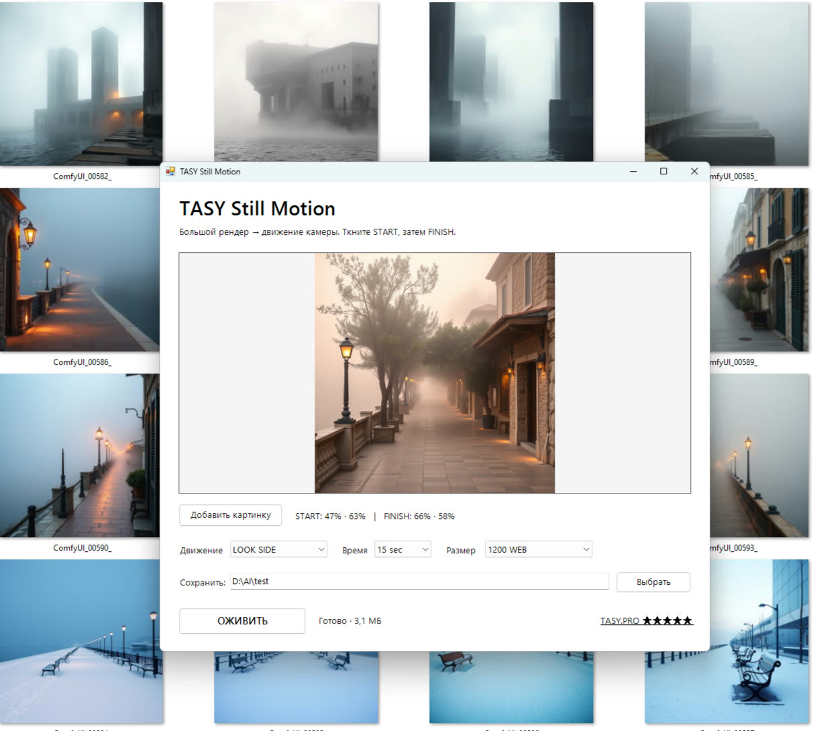
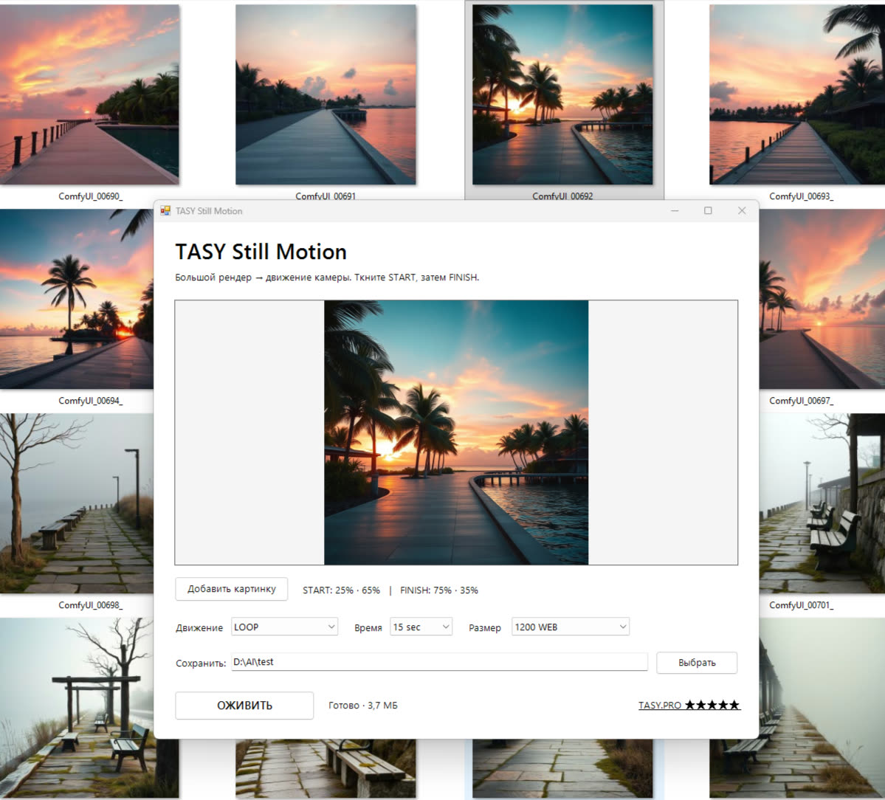

# TasyTools

**Tiny Windows tools for images and motion. Powered by FFmpeg. No cloud. No accounts. No subscriptions.**\n\n[Русская версия](README_RU.md)

TasyTools is a small collection of practical utilities for people who work with images, textures, architectural renders, generated media, websites, forums and online portfolios.

**One engine. Small interfaces. Specific jobs.**

## Download all TasyTools

[**⬇ DOWNLOAD ALL TASYTOOLS**](https://github.com/tvolkf-star/TasyTools/releases/download/tasytools-v1.1/TasyTools-all.zip)

One clean package with all current TasyTools. Each tool stays in its own folder and can be used independently.

## Simple things

**Difficult times call for simple things. And maximum control.**

TasyTools are tiny programs for real, highly relevant tasks.

Cleaning images of metadata clutter. Lighter, cleaner traffic. Comfortable work with textures and materials. Lighter textures, lighter scenes, more speed and more possibilities.

Making video lighter and converting it into practical web formats.

Creating short videos for architectural projects without neural networks or heavyweight software. Simple motion at the click of a button.

**A philosophy of minimalism, backed by mathematics.**

## Download separately

| Tool | What it does | Download |
|---|---|---|
| **TASY Image Diet** | Batch image optimization | [**Download image-diet.zip**](https://github.com/tvolkf-star/TasyTools/releases/download/image-diet-v1.0/image-diet.zip) |
| **TASY Motion Diet** | Generated video → compact web animation | [**Download motion-diet.zip**](https://github.com/tvolkf-star/TasyTools/releases/download/motion-diet-v1.0/motion-diet.zip) |
| **TASY Still Motion** | Camera move from a still image | [**Download still-motion.zip**](https://github.com/tvolkf-star/TasyTools/releases/download/still-motion-v1.0/still-motion.zip) |\n| **TASY Water Motion** | Animate masked water, optional camera move | [**Download water-motion.zip**](https://github.com/tvolkf-star/TasyTools/releases/download/tasytools-v1.1/water-motion.zip) |

## Why TasyTools?

Internet connections are not always fast, while images and generated video are often much heavier than their practical use requires. Large dimensions, metadata and encoding choices can consume far more storage and bandwidth than the visible content needs.

For textures, websites, forums, previews, portfolios and everyday image exchange, that extra weight matters.

TasyTools grew out of repeated real-world tasks: **take a file or a folder, remove what is unnecessary, keep the useful visual result, and make the operation repeatable without rebuilding an FFmpeg command every time.**

The programs are deliberately tiny. FFmpeg does the heavy lifting; TasyTools provides small task-specific Windows interfaces around it. Processing stays local.

---

## TASY Image Diet

### Make images lighter

Batch optimizer for websites, forums, previews, textures and everyday online use. It removes metadata, converts PNG/JPG/JPEG images to JPEG and limits the longest side to **1400 px** without upscaling.

| Example | Original | Result | Reduction |
|---|---:|---:|---:|
| `2026-10-06_21-50-05` | 2015×1084 PNG · 2.99 MB | 1400×754 JPEG · 223 KB | **13.4× smaller** |
| `ComfyUI_00505_` | 1024×1024 PNG · 1.72 MB | 1024×1024 JPEG · 214 KB | **8.0× smaller** |
| `ComfyUI_00419_` | 1024×1024 PNG · 1.34 MB | 1024×1024 JPEG · 138 KB | **9.8× smaller** |

| Original | Image Diet result |
|---|---|
|  |  |

**Important:** PNG transparency is not preserved because output is JPEG.

[**Download TASY Image Diet**](https://github.com/tvolkf-star/TasyTools/releases/download/image-diet-v1.0/image-diet.zip) · [Documentation](tools/image-diet/) · [Source](tools/image-diet/TASY-Image-Diet.ps1)

---

## TASY Motion Diet

### Put generated video on a diet

Converts common video formats to compact **Animated WebP or GIF**, removes audio and metadata and limits the longest side to **480 px** without upscaling.

### Real LIGHT output

**480×480 Animated WebP · 2.12 MB · LIGHT preset**

Presets: **ULTRA BEAUTY · BEAUTY · LIGHT · UI**

The source video is not modified.

[**Download TASY Motion Diet**](https://github.com/tvolkf-star/TasyTools/releases/download/motion-diet-v1.0/motion-diet.zip) · [Documentation](tools/motion-diet/) · [Source](tools/motion-diet/TASY-Motion-Diet.cs)

---

## TASY Still Motion

### Turn a still image into a short camera move

Choose a **START** point and a **FINISH** point directly on the image, select duration, output size and movement style, and create a smooth H.264 MP4.

| Interface | |
|---|---|
|  |  |
|  |  |

### Real LOOP example

**1200×1200 MP4 · 15 s · 30 fps · 3.93 MB**

[**Open the original MP4 example**](https://github.com/tvolkf-star/TasyTools/releases/download/still-motion-v1.0/loop-example.mp4)

Movement: **LOOK IN · LOOK UP · LOOK SIDE · DETAIL · DRIFT · LOOP**

Output sizes: **480 FORUM · 1200 WEB · SOURCE**

The source image is not modified.

[**Download TASY Still Motion**](https://github.com/tvolkf-star/TasyTools/releases/download/still-motion-v1.0/still-motion.zip) · [Documentation](tools/still-motion/) · [Source](tools/still-motion/TASY-Still-Motion.cs)

---

## TASY Water Motion

### Animate water without redrawing the image

Paint the water directly on the still image, choose **CALM / RIPPLE / WIND**, adjust strength and preview a seamless procedural loop. The brush is adjustable from **10 to 500 px**. Left mouse paints the mask; right mouse erases.

Optional **CAMERA IN** adds a smooth forward camera move while keeping the loop seamless.

**Real examples**

[**Water only · MP4**](https://github.com/tvolkf-star/TasyTools/releases/download/tasytools-v1.1/water-only.mp4) · [**Water + Camera In · MP4**](https://github.com/tvolkf-star/TasyTools/releases/download/tasytools-v1.1/water-camera.mp4)

The mask is part of the motion control. Selective, irregular painting can break up overly uniform movement and make reflections feel more natural.

The source image is not modified.

[**Download TASY Water Motion**](https://github.com/tvolkf-star/TasyTools/releases/download/tasytools-v1.1/water-motion.zip) · [Documentation](tools/water-motion/) · [Source](tools/water-motion/TASY-Water-Motion.cs)

---

## Requirements

- Windows
- FFmpeg available in `PATH`, beside the program, or in the supported `tools\\ffmpeg.exe` location
- Windows PowerShell + WinForms for Image Diet
- Classic .NET Framework C# compiler only if building Motion Diet, Still Motion or Water Motion from source

FFmpeg is **not bundled** with TasyTools. It remains a separate project under its own licensing terms. See [THIRD_PARTY.md](THIRD_PARTY.md).

Project: [tasy.pro](https://tasy.pro/)

*Documentation and GitHub packaging prepared with ChatGPT, GPT-5.6 Sol, Instant mode.*

## License

TasyTools is released under the [MIT License](LICENSE).

Copyright © 2026 **Tasy Volkova**
